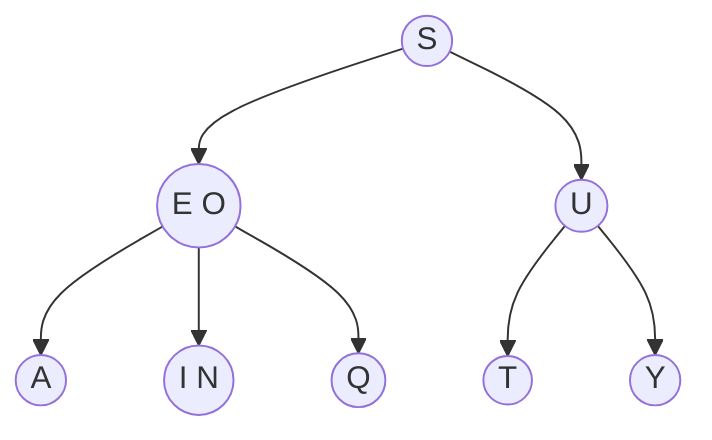

Q: Draw a 2-3 tree that results when you insert the keys `E A S Y Q U T I O N` in that order into an initially empty tree.

A:

```mermaid
graph TB
a((S)) --> b((E O))
b((E O)) --> c((A))
b((E O)) --> d((I N))
b((E O)) --> e((Q))
a((S)) --> f((U))
f((U)) --> g((T))
f((U)) --> h((Y))
```

