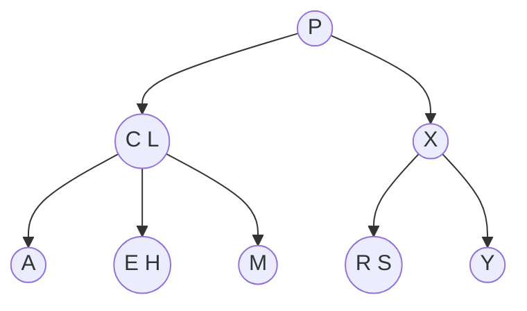

Q: Draw the 2-3 tree that results when you insert the keys `Y L P M X H C R A E S` in that order into an initially empty tree.

A: 

```mermaid
graph TB
a((P)) --> b((C L))
b((C L)) --> c((A))
b((C L)) --> d((E H))
b((C L)) --> e((M))
a((P)) --> f((X))
f((X)) --> g((R S))
f((X)) --> h((Y))
```

