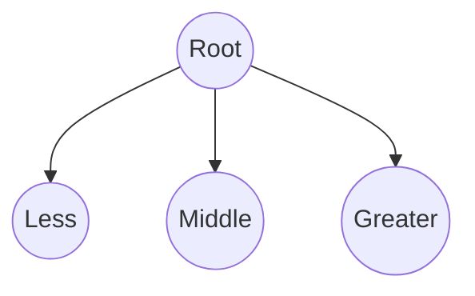
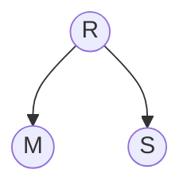
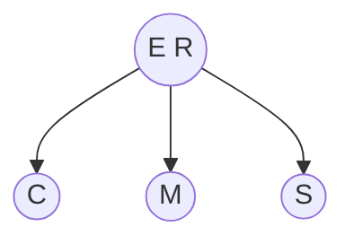

Q: Find an insertion order for the keys `S E A R C H X M ` that leads to a 2-3 tree of height 1.

A: With 8 nodes, a 2-3 tree with a height of 1 should have 4 3-nodes in total. The root node, therefore, will have to be the median. This is because the left link must be less than the keys of the root, the middle link must be between the keys of the root, and the right link must be greater than the keys of the root. This is illustrated below:

In order for this structure to be obtained, we must sort the keys (to ` A C E H M R S X`) and then divide them into thirds. This means that `E` and `R` are keys of the root. In order for `E` and `R` to be become the keys, we must do the following: first, get either `E ` or `R` to become the root. This can be done by adding the keys from `M` to `S` in order. Therefore, `R` becomes the root and `S` and `M` are its children:

From there, add the node `E` and the key directly below it, `C`, such that `E` becomes part of the root:

At this point, the remaining nodes are all equally distributed among the thirds of the sorted list, and we may add them in any order.

Thus, one ordering to maintain the height of the tree is `M R S E C X A H`